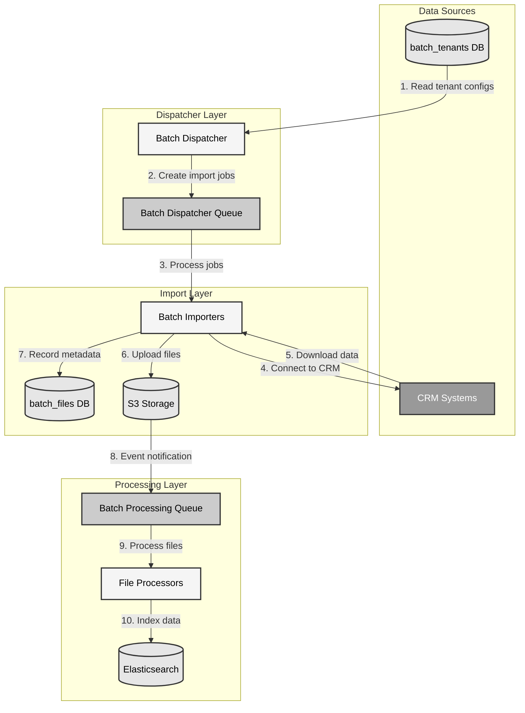

# Batch Importers: Getting Started

## Interactive Walkthrough

**🚀 This is a hands-on, interactive walkthrough!** 

You are expected to run each command as you go through this guide. Each step builds on the previous one, so follow them in order and execute the commands in your terminal.

**Prerequisites**: Make sure you have completed the [Environment Setup](01-environment-setup.md) first.

## Overview

The Blueprint batch processing system provides a scalable, multi-tenant solution for importing data from various CRM systems. This guide will help you understand the batch import architecture and get you started with developing your own batch importers.

## Architecture

The batch import system consists of several components working together:




1. **Batch Tenants**: Configuration for each tenant stored in the `batch_tenants` table
2. **Batch Dispatcher**: Scans for tenants and dispatches import jobs to the queue
3. **Batch Dispatcher Queue**: SQS queue that holds import jobs
4. **Batch Importers**: Worker services that process jobs from the queue
5. **S3 Storage**: Where imported files are stored
6. **Batch Processing Queue**: Triggered by S3 events when new files are created
7. **File Processors**: Process the imported files for further use

## Workflow

The typical workflow for batch importing is:

1. The batch dispatcher scans the `batch_tenants` table for active tenants
2. For each tenant, it creates a job and sends it to the batch dispatcher queue
3. Batch importer workers pick up jobs from the queue
4. Each importer connects to the appropriate CRM system and downloads data
5. The importer uploads the data to S3 and records metadata in the database
6. S3 event notifications trigger messages in the batch processing queue
7. File processors pick up these messages and process the files

## What You'll Learn

In this guide, you'll learn how to:

1. [Set up your local development environment](01-environment-setup.md)
2. [Understand the batch tenant configuration](02-tenant-configuration.md)
3. [Explore the Hubspoof importer example](03-hubspoof-example.md)
4. [Create your own batch importer](04-creating-importers.md)
5. [Test and troubleshoot your importer](05-testing-troubleshooting.md)

## Prerequisites

Before you begin, make sure you have:

- Docker Desktop installed
- AWS CLI and awslocal installed
- Node.js 16+ and npm installed
- Basic understanding of TypeScript and AWS services

## Quick Start

**Follow these steps in order - execute each command as you go:**

If you're eager to see the system in action, follow these steps:

1. **Navigate to the project root:**

```bash
cd /Users/clomeli/Source/acme/projects/blueprint/blue-demo
```

2. **Start the local environment:**

```bash
docker-compose -f infrastructure/local/docker/docker-compose.yaml down -v
docker-compose -f infrastructure/local/docker/docker-compose.yaml up -d
```

3. **Wait for all services to start** (this may take a few minutes)

4. **Verify the environment is ready:**

```bash
# Check that buckets exist
awslocal s3 ls

# Verify buckets are initially empty
awslocal s3 ls s3://crmdata/ --recursive
```

5. **Run the batch dispatcher:**

```bash
npx tsx packages/publishing/contact-sync/dispatcher-bulk/src/intent-handler.ts
```

6. **Configure the batch importer for one-shot processing:**

Before running the batch importer, you need to set it to one-shot mode instead of continuous server mode. Edit the file:

```bash
# Edit the context-provider.ts file
nano packages/publishing/contact-sync/contact-importers/src/context-provider.ts
```

Find line 39 and change `serverMode: true` to `serverMode: false`:

```typescript
serverMode: false, // Set to false for one-shot processing in interactive walkthrough
```

7. **Run the batch importer:**

```bash
npx tsx packages/publishing/contact-sync/contact-importers/src/intent-handler.ts
```

8. **Check the results:**

```bash
# Check S3 for uploaded files in the crmdata bucket
awslocal s3 ls s3://crmdata/ --recursive

# Check the batch_files table for recorded files
docker exec crmdb crmdb -uroot -proot event -e "SELECT id, business_id, file_path, status FROM batch_files ORDER BY created_at DESC LIMIT 5;"
```

For a more detailed walkthrough, continue to the [Environment Setup](01-environment-setup.md) guide.
