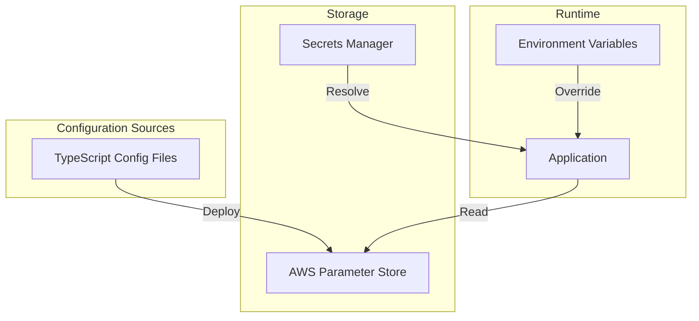
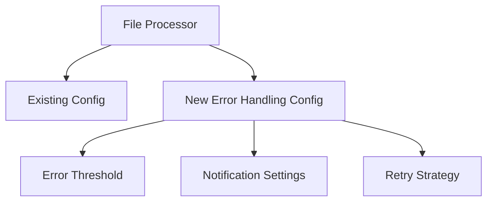

# Blueprint Configuration Workshop

This workshop provides a hands-on exploration of the Blueprint configuration management system. You'll learn how configuration is structured, deployed, accessed, and used in applications through practical exercises using the existing batch processing pipeline components.

## Workshop Overview

In this workshop, you will:

1. Explore the configuration architecture of Blueprint
2. Deploy and modify configuration for batch processing components
3. Work with secrets management
4. Troubleshoot common configuration issues
5. Extend configuration for new features

## Why Configuration Management Matters

Before diving into the technical details, let's understand why proper configuration management is crucial:

1. **Environment Consistency**: Applications need to behave consistently across different environments (local, dev, test, production) while adapting to environment-specific resources.

2. **Security**: Sensitive information like credentials and API keys must be stored securely and accessed only when needed.

3. **Operational Flexibility**: Configuration changes should be possible without code changes or redeployment.

4. **Auditability**: Configuration changes should be trackable, versioned, and reviewable.

5. **Developer Experience**: Configuration should be easy to understand, modify, and validate.

Blueprint's configuration system addresses these needs through a layered approach with strong typing, secure secret management, and centralized storage.

## Prerequisites

- Docker and Docker Compose installed and running
- LocalStack running (for AWS service emulation)
- Basic understanding of TypeScript
- Familiarity with AWS Parameter Store and Secrets Manager concepts

## Configuration Architecture

Blueprint uses a layered configuration approach with strong TypeScript typing:



Key components:
- **TypeScript Config Files**: Source of truth for configuration, providing type safety and IDE support
- **AWS Parameter Store**: Runtime storage for configuration, providing centralized access and versioning
- **Secrets Manager**: Secure storage for sensitive values, with access controls and rotation capabilities
- **Environment Variables**: Runtime overrides for quick testing and emergency changes
- **ConfigProvider**: Library for accessing configuration, handling merging and secret resolution

This architecture separates configuration definition (TypeScript files) from storage (Parameter Store) and access (ConfigProvider), enabling a clean separation of concerns.

## Part 1: Understanding Configuration Structure

### Step 1: Examine the Configuration Files

Let's start by examining the configuration structure for the batch processing pipeline:

```bash
# View shared configuration
cat packages/common/infrastructure/config/config.shared.ts

# View batch importer configuration
cat packages/publishing/crm/hubspoof/batch-importer/config.app.ts

# View file discovery configuration
cat packages/publishing/contact-sync/file-reader/config.app.ts

# View file processor configuration
cat packages/publishing/contact-sync/contact-writers/config.app.ts
```

**Why This Matters**: Understanding the configuration structure is essential for developers to know what settings are available, how they're organized, and how they relate to application behavior. The TypeScript files provide type safety and documentation through types.

### Step 2: Understand Application Identity

Application identity is crucial for configuration access:

```bash
# View the application identity for batch importer
cat packages/publishing/crm/hubspoof/batch-importer/context-provider.ts
```

The `APP_IDENTITY` object defines how the application identifies itself to the configuration system, determining which configuration parameters it can access.

**Why This Matters**: Application identity ensures that each application only accesses its own configuration, preventing configuration leakage between applications and enabling fine-grained access control.

## Part 2: Deploying Configuration

### Step 1: Start LocalStack

Ensure LocalStack is running to emulate AWS services:

```bash
docker-compose -f environments/local/docker-compose.yml up -d localstack
```

**Why This Matters**: LocalStack provides a local emulation of AWS services, allowing developers to test configuration deployment and access without incurring AWS costs or requiring internet connectivity.

### Step 2: Deploy Shared Configuration

Deploy the shared infrastructure configuration that all applications depend on:

```bash
bash packages/tools/dev-bootstrap/config-manager.sh deploy-shared -e local -f packages/tools/dev-bootstrap/config/shared-config.yaml
```

**Why This Matters**: Shared configuration contains settings that multiple applications need, such as database connection details, AWS credentials, and common service endpoints. Centralizing these settings ensures consistency across applications and reduces duplication.

### Step 3: Deploy Application-Specific Configuration

Deploy configuration for the batch processing components:

```bash
# Deploy batch importer configuration
bash packages/tools/dev-bootstrap/config-manager.sh deploy-app -a hubspoof-batch-importer -e local -f packages/publishing/crm/hubspoof/batch-importer/config/batch-importer.yaml

# Deploy file discovery configuration
bash packages/tools/dev-bootstrap/config-manager.sh deploy-app -a file-reader -e local -f packages/publishing/contact-sync/file-reader/config/file-reader.yaml

# Deploy file processor configuration
bash packages/tools/dev-bootstrap/config-manager.sh deploy-app -a file-processor -e local -f packages/publishing/contact-sync/contact-writers/config/file-processor.yaml
```

**Why This Matters**: Application-specific configuration contains settings that are unique to each application, such as feature flags, application-specific timeouts, and behavior controls. Separating these from shared configuration allows applications to evolve independently.

### Step 4: Verify Configuration Deployment

Check that the configuration was deployed correctly:

```bash
aws --endpoint-url=http://localhost:4566 ssm get-parameters-by-path --path / --recursive --query "Parameters[*].{Name:Name,Value:Value}" --output table
```

**Why This Matters**: Verification ensures that configuration was deployed correctly and is available for applications to use. This step is crucial for catching deployment issues early, before they affect application behavior.

## Part 3: Working with Secrets

### Step 1: Examine Secret References

Look at how secrets are referenced in configuration:

```bash
# Find secret references in configuration files
grep -r "!ssm<" packages/
```

Secret references use the syntax `!ssm<secret-name>[field]`.

**Why This Matters**: Secret references allow sensitive information to be stored securely in Secrets Manager while still being referenced in configuration. This separation ensures that secrets are not exposed in code, logs, or configuration repositories.

### Step 2: Deploy a New Secret

Create and deploy a new secret:

```bash
# Create a secret file
cat > /tmp/new-secret.json << EOF
{
  "username": "batch-user",
  "password": "batch-password",
  "api_key": "abc123def456"
}
EOF

# Deploy the secret
aws --endpoint-url=http://localhost:4566 secretsmanager create-secret --name batch/api/credentials --secret-string file:///tmp/new-secret.json
```

**Why This Matters**: Secrets Manager provides secure storage for sensitive information with access controls, encryption, and rotation capabilities. Creating secrets separately from configuration ensures that sensitive information is handled with appropriate security measures.

### Step 3: Reference the Secret in Configuration

Update a configuration file to reference the new secret:

```bash
# Update file processor configuration
cat > /tmp/updated-config.yaml << EOF
file-processor:
  local:
    api:
      credentials:
        username: "!ssm<batch/api/credentials>[username]"
        password: "!ssm<batch/api/credentials>[password]"
        apiKey: "!ssm<batch/api/credentials>[api_key]"
EOF

# Deploy the updated configuration
bash packages/tools/dev-bootstrap/config-manager.sh deploy-app -a file-processor -e local -f /tmp/updated-config.yaml
```

**Why This Matters**: Secret references in configuration allow applications to access sensitive information without hardcoding it. This approach enables secret rotation without code changes and ensures that secrets are only accessed when needed.

## Part 4: Configuration in Action

### Step 1: Run a Configuration-Aware Application

We've created a simple configuration-aware application to demonstrate how applications use the configuration system:

```bash
# Run the configuration-aware application in local environment
npx tsx packages/publishing/demo/config-aware-app.ts local
```

This application:
1. Initializes its configuration context with an application identity
2. Fetches shared infrastructure configuration from Parameter Store
3. Fetches application-specific configuration from Parameter Store
4. Resolves secret references from Secrets Manager at runtime
5. Merges the configurations with app-specific taking precedence
6. Uses the configuration values to control application behavior

**Why This Matters**: Understanding how applications access and use configuration is essential for developers to implement configuration-aware features. This demo shows the complete flow from configuration retrieval to usage, including secret resolution and environment-specific behavior.

### Step 2: Run the Application in a Different Environment

Try running the same application in the dev environment:

```bash
# Run the configuration-aware application in dev environment
npx tsx packages/publishing/demo/config-aware-app.ts dev
```

Notice how the configuration values change based on the environment.

**Why This Matters**: Environment-specific configuration allows applications to adapt to different environments without code changes. This is crucial for maintaining consistency across environments while accommodating environment-specific resources and behaviors.

### Step 3: Explore Configuration Troubleshooting

Run the troubleshooting demo to see common configuration issues and how to resolve them:

```bash
# Run the configuration troubleshooting demo
npx tsx packages/publishing/demo/config-troubleshooting.ts
```

This demo shows:
1. How to handle missing parameters with clear error messages
2. How to validate secret reference formats to catch syntax errors early
3. How to handle missing secrets with helpful troubleshooting steps
4. How to handle missing fields in secrets with recovery suggestions

**Why This Matters**: Configuration issues can be difficult to diagnose without proper error handling and troubleshooting tools. This demo shows how to implement robust error handling for configuration access, making it easier for developers to identify and fix configuration issues.

### Step 4: See Configuration Integration with Batch Processing

Run the batch processing integration demo to see how the file processor service uses configuration:

```bash
# Run the batch processing configuration integration demo
npx tsx packages/publishing/demo/batch-config-integration.ts local
```

This demo simulates how the file processor service:
1. Bootstraps its configuration with proper application identity
2. Resolves secrets for secure access to external services
3. Uses configuration to connect to databases, S3, and other services
4. Configures worker behavior based on configuration settings
5. Sets up notifications based on configuration preferences

**Why This Matters**: Real-world applications use configuration to control various aspects of their behavior. This demo shows how configuration influences different components of a service, demonstrating the practical impact of configuration on application behavior.

## Part 5: Configuration Validation

### Step 1: Validate Configuration Structure

Use the configuration testing tool to validate configuration:

```bash
npm run config:test-flow -- -a file-reader -e local
```

This ensures that:
- All required configuration keys are present
- Values have the correct types
- Secret references are valid

**Why This Matters**: Configuration validation ensures that configuration is correct and consistent before deployment, preventing errors and reducing debugging time.

### Step 2: Run Validation in Verbose Mode

Get detailed information about the validation process:

```bash
npm run config:test-flow -- -a file-reader -e local --verbose
```

**Why This Matters**: Verbose mode provides detailed insights into the validation process, helping developers understand what checks are performed and why configuration might be invalid.

## Part 6: Troubleshooting Configuration Issues

### Scenario 1: Missing Configuration

Let's simulate a missing configuration scenario:

```bash
# Delete a configuration parameter
aws --endpoint-url=http://localhost:4566 ssm delete-parameter --name local.file-reader.polling

# Run the application and observe the error
npx tsx packages/publishing/contact-sync/file-reader/src/intent-handler.ts
```

**Why This Matters**: Missing configuration can cause applications to fail or behave unexpectedly. This scenario demonstrates how to identify and fix missing configuration issues.

### Scenario 2: Invalid Secret Reference

Simulate an invalid secret reference:

```bash
# Update configuration with an invalid secret reference
cat > /tmp/invalid-secret-config.yaml << EOF
file-reader:
  local:
    credentials:
      apiKey: "!ssm<non-existent-secret>[key]"
EOF

# Deploy the invalid configuration
bash packages/tools/dev-bootstrap/config-manager.sh deploy-app -a file-reader -e local -f /tmp/invalid-secret-config.yaml

# Run the application and observe the error
npx tsx packages/publishing/contact-sync/file-reader/src/intent-handler.ts
```

**Why This Matters**: Invalid secret references can cause applications to fail or behave unexpectedly. This scenario demonstrates how to identify and fix invalid secret reference issues.

### Scenario 3: Type Mismatch

Simulate a type mismatch in configuration:

```bash
# Update configuration with a type mismatch
cat > /tmp/type-mismatch-config.yaml << EOF
file-reader:
  local:
    polling:
      interval: "not-a-number"
EOF

# Deploy the invalid configuration
bash packages/tools/dev-bootstrap/config-manager.sh deploy-app -a file-reader -e local -f /tmp/type-mismatch-config.yaml

# Run the application and observe the error
npx tsx packages/publishing/contact-sync/file-reader/src/intent-handler.ts
```

**Why This Matters**: Type mismatches can cause applications to fail or behave unexpectedly. This scenario demonstrates how to identify and fix type mismatch issues.

## Part 7: Extending Configuration for New Features

### Step 1: Plan the Configuration Extension

Let's extend the file processor configuration to support a new feature: custom error handling.



**Why This Matters**: Extending configuration for new features allows applications to evolve without requiring significant code changes. This approach enables developers to add new features while maintaining a clean and organized configuration structure.

### Step 2: Define the Configuration Extension

Create a new configuration file with the extension:

```bash
cat > /tmp/error-handling-config.yaml << EOF
file-processor:
  local:
    errorHandling:
      threshold: 10
      notification:
        enabled: true
        recipients: ["admin@example.com"]
      retry:
        maxAttempts: 3
        backoffFactor: 1.5
EOF
```

**Why This Matters**: Defining the configuration extension in a separate file keeps the configuration organized and easy to manage. This approach enables developers to focus on the new feature without affecting existing configuration.

### Step 3: Deploy the Extended Configuration

Deploy the configuration extension:

```bash
bash packages/tools/dev-bootstrap/config-manager.sh deploy-app -a file-processor -e local -f /tmp/error-handling-config.yaml
```

**Why This Matters**: Deploying the extended configuration makes the new feature available to the application. This step ensures that the application can use the new configuration to control its behavior.

### Step 4: Update Application Code to Use the New Configuration

In a real scenario, you would update the application code to use the new configuration. For this workshop, we'll just examine how it would be accessed:

```typescript
// Example code for accessing the new configuration
const errorThreshold = config.errorHandling.threshold;
const notificationEnabled = config.errorHandling.notification.enabled;
const retryMaxAttempts = config.errorHandling.retry.maxAttempts;
```

**Why This Matters**: Updating the application code to use the new configuration enables the application to take advantage of the new feature. This step demonstrates how to access the new configuration values in the application code.

## Part 8: Multi-Environment Configuration

### Step 1: Examine Environment-Specific Configuration

Look at how configuration varies across environments:

```bash
# View shared configuration for different environments
cat packages/common/infrastructure/config/config.shared.ts
```

Notice how the configuration is organized by environment (local, development, staging, production).

**Why This Matters**: Environment-specific configuration allows applications to adapt to different environments without code changes. This approach enables developers to maintain consistency across environments while accommodating environment-specific resources and behaviors.

### Step 2: Deploy Configuration to a Different Environment

Deploy configuration to a simulated development environment:

```bash
# Deploy shared configuration to development
bash packages/tools/dev-bootstrap/config-manager.sh deploy-shared -e development -f packages/tools/dev-bootstrap/config/shared-config.yaml --dry-run

# Deploy application configuration to development
bash packages/tools/dev-bootstrap/config-manager.sh deploy-app -a file-processor -e development -f packages/publishing/contact-sync/contact-writers/config/file-processor.yaml --dry-run
```

The `--dry-run` flag shows what would be deployed without actually making changes.

**Why This Matters**: Deploying configuration to different environments enables developers to test and validate configuration changes before applying them to production. This approach ensures that configuration changes are thoroughly tested and validated before affecting the production environment.

## Conclusion

In this workshop, you've learned:

1. How Blueprint's configuration system is structured
2. How to deploy and modify configuration
3. How to work with secrets
4. How to validate configuration
5. How to troubleshoot common configuration issues
6. How to extend configuration for new features
7. How to manage configuration across environments

These skills will help you effectively manage configuration for your Blueprint applications, ensuring they are secure, maintainable, and adaptable to different environments.

## Next Steps

- Explore the configuration for other Blueprint components
- Create a new application with its own configuration
- Implement configuration validation in your CI/CD pipeline
- Develop a strategy for managing configuration changes across environments
