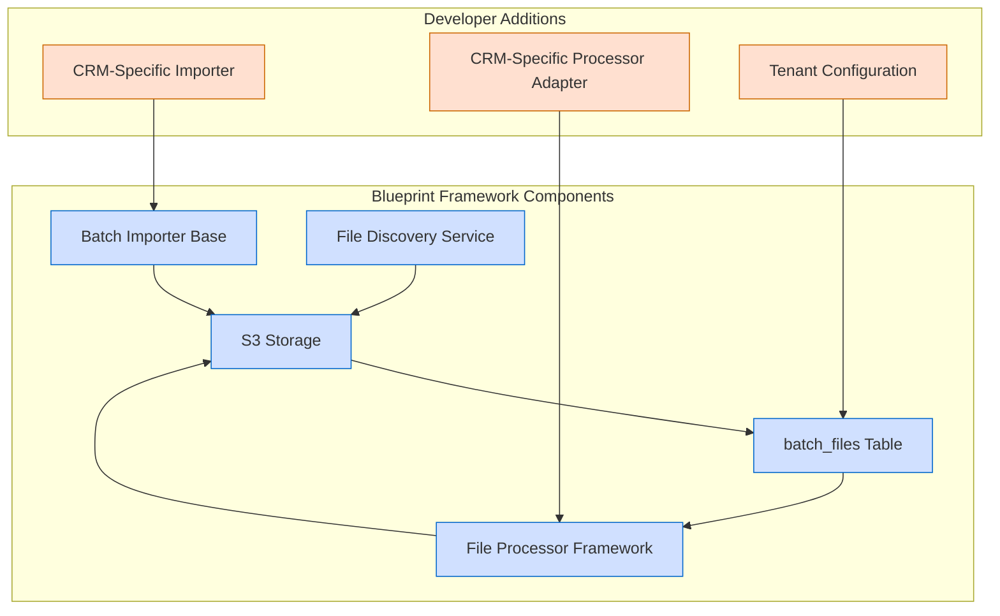

# File Processor Guide

This guide walks you through understanding and running the file processor service in the Blueprint framework.

## What is the File Processor Service?

The file processor is the third component in the Blueprint batch processing pipeline. It:



The file processor service:
- Reads files from S3 that were discovered by the file discovery service
- Uses CRM-specific adapters to process the data in each file
- Writes the processed data to a MySQL table (and eventually to Elasticsearch)
- Updates the status of files in the `batch_files` table
- Tracks processing progress per tenant in the `batch_tenants` table

## How the File Processor Works

The file processor follows these steps:

1. **Tenant Claiming**: Claims tenants from the `batch_tenants` table to prevent duplicate processing
2. **File Selection**: Finds files with status "PENDING" in the `batch_files` table
3. **File Download**: Downloads the files from S3
4. **CRM-Specific Processing**: Uses the appropriate adapter based on the CRM type
5. **Data Storage**: Writes processed data to a MySQL table (in this demo) or Elasticsearch
6. **Status Updates**: Updates file status to "PROCESSED" or "ERROR"
7. **Tenant Release**: Updates tenant processing status and releases the lock

## Prerequisites

Before running the file processor, ensure you have:

1. Docker environment running with all required services
2. Shared configuration parameters loaded in AWS Parameter Store
3. Files discovered by the file discovery service with status "PENDING"
4. CRM-specific processor adapters for each CRM type you want to process

**Note: This guide assumes you have already completed the Batch Importer and File Discovery walkthroughs, which create and discover the files needed for this demo.**

## Step 1: Check Current State Before Processing

Before running the file processor, let's check the current state of the batch_files table:

```bash
# Check batch_files table before processing
docker exec crmdb crmdb -uroot -proot event -e "SELECT id, business_id, file_path, total_records, status FROM batch_files ORDER BY updated_at DESC LIMIT 6;"
```

You should see:
- Files with status "PENDING" that were updated by the file discovery service
- Total records showing the actual row count in each file

## Step 2: Run the File Processor

Now you can run the file processor to process the discovered files:

```bash
# Run the file processor
cd /Users/clomeli/Source/acme/projects/blueprint/blue-demo
node scripts/run.js packages/publishing/contact-sync/contact-writers/src/intent-handler.ts
```

> 🤖 **Cascade Automation**: `/demo-batch-process` - Runs the file processor to process discovered files

During execution, you'll see logs showing:
- Tenant claiming (e.g., "Claimed tenant for processing")
- File selection and downloading
- Record processing statistics
- Error handling and classification
- Status updates

## Step 3: Check for Updated File Status

After running the file processor, verify that the file status was updated in the database:

```bash
# Check batch_files table after processing
docker exec crmdb crmdb -uroot -proot event -e "SELECT id, business_id, file_path, total_records, status FROM batch_files ORDER BY updated_at DESC LIMIT 6;"
```

You should see changes in the batch_files table:
- Status changed from "PENDING" to "PROCESSED" (or "ERROR" if there were issues)
- Updated_at timestamp showing when the file processor ran

## Step 4: Check the Processed Data

Let's check the MySQL table where the processed data was written:

```bash
# Check the test_batch_files table for processed data
docker exec crmdb crmdb -uroot -proot event -e "SELECT id, payload FROM test_batch_files ORDER BY id DESC LIMIT 10;"
```

You should see:
- JSON payloads containing the processed data from each file
- One row per record from the original CSV files

## What We've Learned

The file processor demonstrates several key concepts:

1. **Adapter Pattern**:
   - Uses CRM-specific adapters to handle different data formats and business rules
   - Makes it easy to add support for new CRMs by creating new adapters

2. **Worker Architecture**:
   - Claims tenants to prevent duplicate processing
   - Processes files in batches for efficiency
   - Handles graceful shutdown and error recovery

3. **Error Classification**:
   - Categorizes errors as retryable or non-retryable
   - Provides detailed error reporting for debugging

4. **Pipeline Integration**:
   - Completes the batch processing pipeline
   - Updates file status to indicate completion

## Extending for New CRMs

To add support for a new CRM, you need to:

1. Create a new processor adapter in `packages/apps/contact-sync/contact-writers/src/adapters/`
2. Register the adapter in `packages/apps/contact-sync/contact-writers/src/adapters/intents-processor.ts`
3. Add tenants for the new CRM in the `batch_tenants` table

Example of a new processor adapter:

```typescript
import { BatchProcessor, ProcessorResult } from '@framework/batch/models/ProcessorTypes';
import { logger } from '@infrastructure/observability/Logger';

export const newCrmProcessor: BatchProcessor<any> = async (records: any[]): Promise<ProcessorResult<any>> => {
  const log = logger;
  log.info({ count: records.length }, 'Processing NewCRM records');

  const result: ProcessorResult<any> = {
    processedRecords: 0,
    failedRecords: [],
    errors: []
  };

  // CRM-specific processing logic here

  return result;
};
```

Example of registering the new adapter:

```typescript
// In importing/intent-handler.ts
export const processorMap: Record<string, BatchProcessor<any>> = {
  'hubspoof': hubspoofProcessor,
  'gohio': gohioProcessor,
  'newcrm': newCrmProcessor  // Add the new CRM processor
};
```

## Next Steps

After running the file processor:
1. The data is now available in the MySQL table
2. In a production environment, it would be indexed in Elasticsearch
3. You can build APIs and UIs to access and visualize the processed data

For more details on these next steps, see the API Development guide.
