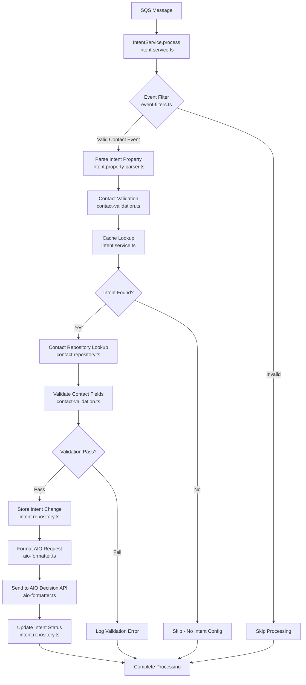

# HubSpot Intent Processing System

This directory contains the core business logic for processing HubSpot webhook events and extracting AI-driven intent signals from contact property changes.

## Overview

The intent processing system analyzes HubSpot contact property updates to identify business intents (like purchase signals, engagement levels, etc.) and forwards relevant data to the AIO (AI Orchestration) decision engine for further processing.

## Architecture Flow

## File Structure and Responsibilities

### Core Processing Files

#### `intent.service.ts` - Main Orchestrator

- **Primary Entry Point**: `processHubspotAIOEvent()`
- **Responsibilities**:
  - Coordinates the entire intent processing workflow
  - Manages concurrency with p-limit
  - Handles error propagation and logging
  - Integrates all other components

#### `event-filters.ts` - Pure Business Logic

- **Functions**: `shouldProcessContactEvent()`, `isValidIntentTrigger()`
- **Responsibilities**:
  - Filters events by subscription type (contact.\*)
  - Validates intent trigger values
  - No external dependencies - pure functions

#### `intent.property-parser.ts` - JSON Extraction

- **Primary Function**: `parseIntentPropertyValue()`
- **Responsibilities**:
  - Safely extracts JSON from HubSpot property values
  - Handles embedded JSON with garbage text
  - Validates against IntentPropertyValueSchema
  - Robust error handling for malformed data

### Data Access Layer

#### `intent.repository.ts` - Database Operations

- **Functions**: `storeIntentChange()`, `updateIntentChange()`
- **Responsibilities**:
  - Stores intent votes in `calls.intent` table
  - Updates intent processing status
  - Uses MySQL connection pool
  - Handles database errors gracefully

#### `contact-validation.ts` - Business Rules

- **Primary Function**: `validateContactRequiredFields()`
- **Responsibilities**:
  - Validates contact has required fields for processing
  - Returns IntentVote with validation results
  - Determines signal scores (FAIL, WAIT, FORWARD)
  - Pure business logic - no external dependencies

#### `data-handlers.ts` - Data Transformation

- **Responsibilities**:
  - Transforms ElasticSearch responses to ContactInfo
  - Handles MySQL business intent row parsing
  - Provides type-safe data conversion utilities
  - Error handling for malformed responses

### Integration Layer

#### `aio-formatter.ts` - External API Integration

- **Primary Function**: `sendIntentChange()`
- **Responsibilities**:
  - Formats AIO decision requests
  - Makes HTTP calls to AIO Decision API
  - Handles API errors and retries
  - Transforms contact data for external consumption

#### `intent.configuration.ts` - Configuration Provider

- **Responsibilities**:
  - Provides static configuration values
  - Maps environment variables to application settings
  - Replaces complex configuration system with simple key-value pairs
  - Maintains compatibility with original webhook-reader config

### Type Definitions

#### `intent.types.ts` - Type System

- **Key Types**:
  - `HubspotUpdateEvent` - Webhook event structure
  - `IntentPropertyValueSchema` - Parsed intent data
  - `ContactInfo` - Contact information structure
  - `IntentVote` - Validation and scoring results
  - `AIODecisionRequest` - External API payload

## Processing Flow Details

### 1. Event Reception

- SQS message contains HubSpot webhook data
- Message includes `portalId`, `objectId`, and full `hubspotEvent`

### 2. Event Filtering

- `shouldProcessContactEvent()` checks if event is contact-related
- Only `contact.*` subscription types are processed
- Invalid events are skipped early

### 3. Property Parsing

- `parseIntentPropertyValue()` extracts JSON from property values
- Handles garbage text around JSON (e.g., "Garbage 'complete': {...} Garbage test")
- Validates against expected schema

### 4. Cache Lookup

- Checks if intent field is configured for the business
- Uses in-memory cache for performance
- Skips processing if no intent configuration found

### 5. Contact Validation

- `validateContactRequiredFields()` ensures contact has necessary data
- Checks for required fields like phone numbers, email, etc.
- Returns validation score and details

### 6. Database Storage

- `storeIntentChange()` persists intent vote to MySQL
- Includes trace ID for debugging
- Stores validation results and signal status

### 7. AIO Integration

- `sendIntentChange()` formats and sends data to AIO Decision API
- Includes contact info, intent data, and business context
- Handles API errors and logging

### 8. Status Updates

- `updateIntentChange()` marks processing completion
- Updates database with final status
- Enables monitoring and debugging

## Error Handling

The system uses a `Result<T>` pattern for consistent error handling:

- `success(data)` for successful operations
- `failure(error)` for errors with type information
- All functions return Results for composable error handling

## Dependencies

### External Libraries

- `@platform/connectors` - Enterprise httpClient for resilient HTTP calls (replaces axios)
- `p-limit` - Concurrency control
- `uuid` - Unique ID generation

### Internal Dependencies

- `acme-common-lib/acme-db-pool` - MySQL connection pooling
- Custom result types and error handling
- Cache interface for intent configuration

## Configuration

Key configuration values (from `intent.configuration.ts`):

- `DATASETS_CONTACTS_NAME` - ElasticSearch index name
- `DECISION_API_URL` - AIO Decision API endpoint
- `CACHE_IN_MEMORY_MAX_SIZE` - Cache size limits
- Various timeout and retry settings

## Testing Considerations

### Pure Functions (Easy to Test)

- `event-filters.ts` - No dependencies
- `contact-validation.ts` - Pure business logic
- `intent.property-parser.ts` - JSON parsing logic

### Integration Points (Require Mocking)

- `intent.service.ts` - Database and HTTP dependencies
- `aio-formatter.ts` - HTTP client
- `intent.repository.ts` - MySQL connections

## Performance Characteristics

- **Concurrency**: Limited to 5 concurrent operations via p-limit
- **Caching**: In-memory cache for intent configurations
- **Database**: Connection pooling for MySQL operations
- **HTTP**: Axios with timeout and retry logic

## Monitoring and Debugging

- Transaction IDs for request tracing
- Structured logging with banner formatting
- Error categorization with AppErrorType
- Database storage of processing results for analysis
